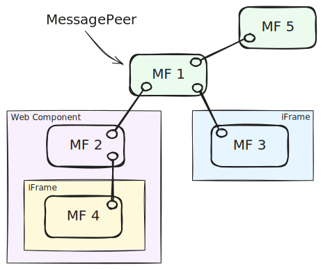

# Amadeus Toolkit for Micro Frontends

## Messaging

The Amadeus Toolkit for Micro Frontends provides a messaging system that allows micro frontends to communicate with each other. The messaging system is based on the [Channel Messaging API](https://developer.mozilla.org/en-US/docs/Web/API/Channel_Messaging_API) and works across iFrames. It can also be used in the same document for talk to MFE packaged as a Web Component for example.

## Features



- typed and versioned messages exchange between message peers
- broadcasting messages across all connected micro frontends (ex. `MF1` to everybody)
- sending messages between two specific micro frontends (ex. `MF4` to `MF3`)
- lifecycle messages (ex. `MF5` disconnected, `MF3` connected)
- message validation before sending and upon reception

## Common use-cases

### Declaring Message types

This is optional, but allows for type checking during development when sending and receiving messages.

```ts
import { Message } from '@amadeus-it-group/microfrontends';

interface HelloMessage extends Message {
  type: 'hello';
  version: '1.0';
  greeting: string;
}

interface HelloMessageV2 extends Message {
  type: 'hello';
  version: '2.0';
  greetings: string[];
}

export type MyMessage = HelloMessage | HelloMessageV2;
```

### Creating a Message Peer

You can create several message peers and connect them to each other in any way avoiding loops. You need to provide some options when creating a peer. Only `id` is technically required.

```ts
import { Message, MessagePeer } from '@amadeus-it-group/microfrontends';

// Message types are optional
const peer = new MessagePeer<MyMessage>({
  // unique identifier for this peer in the network
  id: 'one',

  // callback to handle incoming messages
  onMessage: ({ payload }: MyMessage) => {},

  // handle service messages like `connect`, `disconnect`, etc.
  onServiceMessage: ({ payload }: ServiceMessage) => {},

  // list of messages this peer accepts after creation
  knownMessages: [
    { type: 'hello', version: '1.0' },
    { type: 'hello', version: '2.0' },
  ],
});
```

### Connection to another peers

```ts
import { MessagePeer } from '@amadeus-it-group/microfrontends';

// Create two peers
// First waits for incoming connections from 'two'
const one = new MessagePeer({ id: 'one' });
one.listen('two');

// Second connects to 'one'
const two = new MessagePeer({ id: 'two' });
two.connect('one');

// if connecton crosses iFrames, you might need to provide
// expected window and origin for both `connect` and `listen` methods
one.listen('two', {
  window: iframe.contentWindow,
  origin: 'https://example.com',
});

// Disconnecting
one.disconnect('two'); // disconnect from a specific peer
one.disconnect(); // disconnect from all peers
```

### Sending messages

```ts
import { MessagePeer } from '@amadeus-it-group/microfrontends';
import { MyMessage } from 'app-angular/src/app/one/messages';

// Receiving messages
const one = new MessagePeer<MyMessage>({
  id: 'one',
  onMessage: ({ payload }: MyMessage) => {
    if (payload.type === 'hello') {
      switch (payload.version) {
        case '1.0':
          console.log(payload.greeting); // string
          break;
        case '2.0':
          console.log(payload.greetings); // string[]
          break;
      }
    }
  },
});

// Broadcast a message. Message will be type checked.
two.send({
  type: 'hello',
  version: '1.0',
  greeting: 'Hello, world!',
});

// Send a message to a specific peer. Other peers will not receive it.
two.send(
  {
    type: 'hello',
    version: '2.0',
    greetings: ['Hello', 'world!'],
  },
  {
    to: 'one',
  },
);
```

### Get information about the network

```ts
// List all known peers and their accepted messages
one.knownPeers; // a map of known peers and messages they accept
one.knownPeers.get('two'); // a list of message types peer 'two' accepts
```
